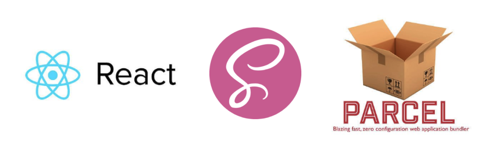

# React + Parcel.js
> Web app template using React and Parcel.js



## Installation

Make sure to install parcel with either Yarn:
```
yarn global add parcel-bundler
```
or npm:
```
npm install -g parcel-bundler
```

Then run:

```
npm start
```

## Contributing

1. Fork it (<https://github.com/abidrahman/react-parcel-template/fork>)
2. Create your feature branch (`git checkout -b feature/fooBar`)
3. Commit your changes (`git commit -am 'Add some fooBar'`)
4. Push to the branch (`git push origin feature/fooBar`)
5. Create a new Pull Request
